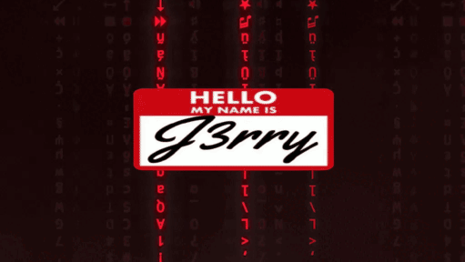

<!--<h3 align="center">Motto: Team Work Makes The Dream Work</h3>
 -->

## ⚙️ Some Tools and Tech I use

| Frontend |    |  Websites | 
| :---: | :---: | :---: |
| Backend |     | Websites & Scripts.
| DevOps |    | Adapt Open Source Solutions for Personal Use and Enterprise Applications. |

  
<h2 align="center">Other places you can find me:</h2>
<h4 align="center">
  <code><a href="https://discord.gg/qMkXrBqzsg"> Discord</a></code>
  <code><a href="https://x.com/J3rryR195"> Twitter</a></code>
  <code><a href="https://t.me/J3rryR195"> Telegram</a></code>
  <code><a href="https://app.hackthebox.com/profile/1265099"> HackTheBox</a></code>

</h4>

